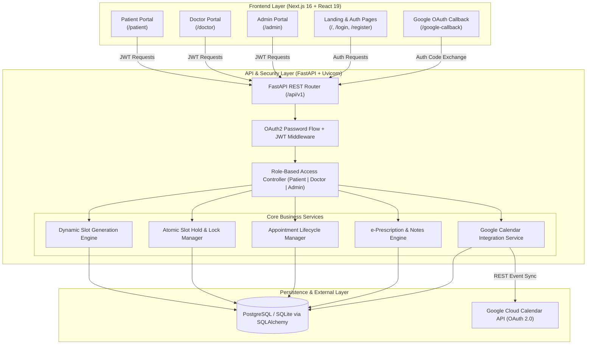
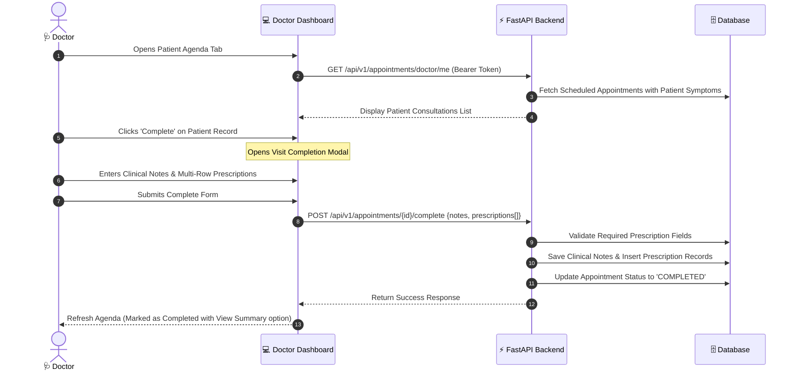

# 🏥 MediFlow: Modern Clinical Scheduling & Patient Management System

> **A high-concurrency healthcare consultation and appointment lifecycle platform featuring atomic slot reservation locks, dynamic scheduling engines, Google Calendar OAuth 2.0 synchronization, structured electronic prescriptions (e-Rx), and multi-tenant Role-Based Access Control (RBAC).**

---

## 📌 Table of Contents

1. [Introduction](#intro)
   - [Problem Statement](#problem-statement)
   - [The MediFlow Solution](#solution)
2. [Project Overview](#overview)
3. [Key Features](#features)
   - [👤 Patient Portal](#patient-portal)
   - [🩺 Doctor Portal](#doctor-portal)
   - [🛡️ Admin Portal](#admin-portal)
4. [System Architecture](#architecture)
5. [Core Logic & Concurrency Workflows](#workflows)
   - [Slot Hold & Atomic Locking Sequence](#slot-lock-workflow)
   - [Doctor Consultation & Prescription Lifecycle](#consultation-lifecycle)
6. [Tech Stack](#tech-stack)
7. [Installation & Setup](#setup)
   - [Backend Configuration](#backend-setup)
   - [Frontend Configuration](#frontend-setup)
   - [Google Calendar OAuth 2.0 Setup](#google-setup)
8. [Default Seeded Credentials](#credentials)
9. [Key API Endpoints](#api-endpoints)
10. [Project Directory Structure](#structure)
11. [Author & Submission Note](#author)

---

## <a id="intro"></a>💡 1. Introduction

### <a id="problem-statement"></a>Problem Statement
Traditional clinical appointment systems are plagued by operational friction, scheduling inefficiencies, and technical vulnerabilities:
*   **Race Conditions & Double-Booking:** When multiple patients attempt to book the same high-demand doctor slot simultaneously, lack of concurrency control causes collision errors, double-booked slots, and patient dissatisfaction.
*   **Symptom Documentation Gaps:** Doctors often enter consultations blind, having to spend the first 10 minutes extracting basic symptom history rather than diagnosing.
*   **Calendar Fragmentation:** Patients and doctors routinely miss visits because hospital bookings are disconnected from their daily personal calendars (Google Calendar).
*   **Disorganized Medical Records & Prescriptions:** Paper prescriptions or unstructured text notes lead to compliance risks, dosage ambiguity, and poor patient follow-up adherence.

---

### <a id="solution"></a>The MediFlow Solution
**MediFlow** transforms healthcare scheduling from static booking into an **Intelligent Clinical Workflow Engine**. Built with enterprise-grade resilience and an elevated user experience, MediFlow provides:
*   **Atomic Slot Reservation Locks:** Implements a temporary 5-minute locking state (`is_held`) with client-side synchronized countdowns, guaranteeing zero double-booking collisions while patients document pre-visit symptoms.
*   **Dynamic On-The-Fly Slot Generator:** Calculates precise, conflict-free appointment slots factoring in custom physician slot durations (15/30/45/60 mins), weekly working hours, approved leaves, and existing bookings.
*   **Seamless Google Calendar OAuth 2.0 Integration:** Automatically writes confirmed appointments to the user's personal Google Calendar and handles automatic event removals on cancellation.
*   **Structured Electronic Prescriptions (e-Rx):** Standardized multi-row medication drafting (Dosage, Frequency, Duration, Special Instructions) coupled with diagnostic summary notes.
*   **Role-Based Access Control (RBAC):** Strict security boundaries and custom operational dashboards for **Patients**, **Doctors**, and **System Administrators**.

---

## <a id="overview"></a>📄 2. Project Overview

**MediFlow** is an end-to-end clinical scheduling and medical records platform designed to streamline outpatient consultations across the entire patient care continuum.

In modern healthcare operations, an appointment is not just a timestamp—it is a binding clinical engagement involving physician availability, patient triage history, calendar commitments, and post-visit treatment plans.

MediFlow brings precision and modern design aesthetics to this process:
1. **Patients** can search verified specialists by medical field, hold a slot with a live countdown timer, log pre-visit symptoms, manage their appointments ledger, and access electronic prescription receipts.
2. **Doctors** manage their patient agenda, customize consultation durations, log clinical findings, issue structured electronic prescriptions, and sync bookings with Google Calendar.
3. **Administrators** control the physician roster, configure granular daily working hours, manage approved leaves, and resolve scheduling conflicts.

---

## <a id="features"></a>✨ 3. Key Features

### <a id="patient-portal"></a>👤 Patient Portal
*   **Clinical Command Dashboard:** Visual overview of upcoming appointments, historical visit ledger count, medication reminders, and Google Calendar sync status.
*   **Specialist Directory & Search:** Real-time search by doctor name or specialty filtering (e.g., *Cardiology, Pediatrics, Orthopedics, Neurology, Dermatology*).
*   **Atomic Slot Hold & Reservation Lock:** Holds selected slots for 5 minutes with a live countdown, preventing other users from claiming the same time while symptom triage is filled out.
*   **Comprehensive Appointments Ledger:** Filter history by status (`ALL`, `BOOKED`, `RESCHEDULED`, `CANCELLED`), reschedule upcoming visits to a new date/time, or cancel visits with automated calendar update triggers.
*   **Digital Visit Receipts:** Access complete post-consultation summaries, physician diagnostic notes, and structured prescription instructions.

### <a id="doctor-portal"></a>🩺 Doctor Portal
*   **Patient Visit Agenda:** Live schedule feed detailing patient names, appointment dates, timeslots, and pre-visit symptom logs.
*   **Clinical Profile & Slot Customization:** Manage medical specialization, professional bio, and choose custom appointment durations (**15, 30, 45, or 60 minutes**).
*   **Visit Completion & e-Prescriptions (e-Rx):** Log detailed clinical diagnosis and generate structured medication regimens (*Medicine Name, Dosage, Frequency, Duration, Instructions*).
*   **Google Calendar Auto-Sync:** One-click OAuth 2.0 authorization to mirror scheduled patient consultations into personal Google Calendars.

### <a id="admin-portal"></a>🛡️ Admin Portal
*   **Doctor Roster Provisioning:** Create, update, activate, or deactivate doctor user accounts with custom default slot durations and specializations.
*   **Granular Schedule Management:** Define weekly working hours (Monday through Sunday) with custom start and end times for each doctor.
*   **Leave & Absence Tracking:** Log doctor leaves with automated detection of conflicts against existing patient bookings.

---

## <a id="architecture"></a>🏗️ 4. System Architecture



---

## <a id="workflows"></a>🔄 5. Core Logic & Concurrency Workflows

### <a id="slot-lock-workflow"></a>1. Slot Hold & Atomic Locking Sequence
To eliminate booking race conditions, MediFlow executes an atomic 2-phase reservation protocol:

```mermaid
sequenceDiagram
    autonumber
    actor Patient as 👤 Patient
    participant Web as 💻 Next.js Frontend
    participant API as ⚡ FastAPI Backend
    participant DB as 🗄️ Database
    participant Google as 📅 Google Calendar API

    Patient->>Web: Selects Doctor & Target Date
    Web->>API: GET /api/v1/appointments/doctors/{id}/slots?date=YYYY-MM-DD
    API->>DB: Query Working Hours, Leaves & Active Bookings/Holds
    API-->>Web: Return Available, Held & Booked Timeslots
    
    Patient->>Web: Clicks on Available Timeslot (e.g., 10:00 AM)
    Web->>API: POST /api/v1/appointments/hold {doctor_id, date, start_time}
    API->>DB: Check if slot is free; Insert/Update Hold Record (5-min expiry)
    API-->>Web: Return Hold Confirmation & Expiry Timestamp
    
    Note over Web, Patient: Client locks slot & starts 5:00 countdown timer.<br/>Slot appears 'Held' to other concurrent users.
    
    Patient->>Web: Enters Symptom Description & Submits Booking
    Web->>API: POST /api/v1/appointments/book {doctor_id, date, time, symptoms}
    API->>DB: Verify Hold Ownership; Transition Slot to 'BOOKED'
    
    opt If User has Google Calendar Connected
        API->>Google: Create Event (Doctor Consultation Details)
        Google-->>API: Return Google Event ID
        API->>DB: Store google_event_id on Appointment
    end

    API-->>Web: Return Booking Confirmation Receipt
    Web-->>Patient: Display Booking Summary in Appointments Ledger
```

---

### <a id="consultation-lifecycle"></a>2. Doctor Consultation & Prescription Lifecycle



---

## <a id="tech-stack"></a>🛠️ 6. Tech Stack

| Domain | Technology | Description & Role |
| :--- | :--- | :--- |
| **Frontend Framework** | **Next.js 16 (App Router)** | Modern React 19 framework with Turbopack compilation |
| **Language (Frontend)** | **TypeScript** | Type-safe frontend component and state management |
| **Styling & Theme** | **Vanilla CSS + Design Tokens** | Glassmorphic clinical UI, responsive grids, and animation utilities |
| **Typography** | **Google Fonts** | *Outfit* (headings & branding) and *Inter* (body & data tables) |
| **Backend Framework** | **FastAPI (Python 3.8+)** | High-performance asynchronous REST API architecture |
| **Application Server** | **Uvicorn (ASGI)** | Production-ready ASGI server for FastAPI |
| **ORM & Database** | **SQLAlchemy + PostgreSQL / SQLite** | Relational data persistence with schema migrations |
| **Authentication** | **OAuth2 + PyJWT + Passlib** | Secure JWT Bearer tokens with Bcrypt password hashing |
| **Calendar Sync** | **Google Calendar API (OAuth 2.0)** | Two-way automated event creation and deletion |

---

## <a id="setup"></a>⚙️ 7. Installation & Setup

### Prerequisites
*   **Node.js**: v18.x or higher
*   **Python**: v3.8 or higher
*   **Package Managers**: `npm` and `pip`

---

### <a id="backend-setup"></a>1. Backend Setup

1. **Clone the repository and enter backend directory**:
   ```bash
   git clone https://github.com/RITESH17-2004/Unthinkable-Assignment.git
   cd "Unthinkable Assignment/backend"
   ```

2. **Create and activate a virtual environment**:
   - **Windows (PowerShell)**:
     ```powershell
     python -m venv venv
     .\venv\Scripts\Activate.ps1
     ```
   - **Linux / macOS**:
     ```bash
     python3 -m venv venv
     source venv/bin/activate
     ```

3. **Install Python dependencies**:
   ```bash
   pip install -r requirements.txt
   ```

4. **Configure Environment Variables (`.env`)**:
   Create a `.env` file in the `backend/` directory:
   ```env
   PROJECT_NAME=MediFlow
   SECRET_KEY=supersecretjwtkey_change_in_production_12345
   ALGORITHM=HS256
   ACCESS_TOKEN_EXPIRE_MINUTES=1440

   # Database Connection (SQLite default for rapid local evaluation)
   DATABASE_URL=sqlite:///./mediflow.db

   # Optional: Google Calendar OAuth 2.0 Credentials
   GOOGLE_CLIENT_ID=your-google-client-id.apps.googleusercontent.com
   GOOGLE_CLIENT_SECRET=your-google-client-secret
   GOOGLE_REDIRECT_URI=http://localhost:3000/google-callback
   ```

5. **Seed Default Admin & Doctor Test Accounts**:
   ```bash
   python seed.py
   ```

6. **Start the FastAPI Server**:
   ```bash
   uvicorn app.main:app --reload --port 8000
   ```
   *   **API Base URL**: `http://localhost:8000`
   *   **Interactive Swagger Documentation**: `http://localhost:8000/docs`

---

### <a id="frontend-setup"></a>2. Frontend Setup

1. **Navigate to the frontend directory**:
   ```bash
   cd ../frontend
   ```

2. **Install Node.js dependencies**:
   ```bash
   npm install
   ```

3. **Launch the Development Server**:
   ```bash
   npm run dev
   ```
   *   **Web Application**: `http://localhost:3000`

4. **Verify Production Build**:
   ```bash
   npm run build
   npm run start
   ```

---

### <a id="google-setup"></a>3. Google Calendar OAuth 2.0 Setup (Optional)

To test live Google Calendar synchronization:
1. Go to the [Google Cloud Console](https://console.cloud.google.com/).
2. Create a project and enable the **Google Calendar API**.
3. Under **APIs & Services > Credentials**, create an **OAuth 2.0 Client ID** (Type: *Web Application*).
4. Add the following redirect URI under **Authorized redirect URIs**:
   ```text
   http://localhost:3000/google-callback
   ```
5. Paste your `GOOGLE_CLIENT_ID` and `GOOGLE_CLIENT_SECRET` into `backend/.env`.
6. Add evaluator email addresses under **OAuth Consent Screen > Test Users**.

---

## <a id="credentials"></a>🔑 8. Default Seeded Credentials

Running `python seed.py` automatically initializes the following accounts for evaluation:

| Role | Email | Password | Permissions & Dashboard Access |
| :--- | :--- | :--- | :--- |
| **System Administrator** | `admin@caresync.com` | `admin123` | Doctor roster creation, Working hours, Leaves management |
| **Doctor (Specialist)** | `doctor@caresync.com` | `doctor123` | Patient agenda, Slot duration settings, Diagnosis & e-Rx |
| **Patient** | *Register via `/register`* | *User specified* | Specialist discovery, Slot hold locks, Appointments ledger |

---

## <a id="api-endpoints"></a>📡 9. Key API Endpoints

### Authentication & Profiles
| Method | Endpoint | Access | Description |
| :--- | :--- | :--- | :--- |
| `POST` | `/api/v1/auth/register` | Public | Register a new patient user |
| `POST` | `/api/v1/auth/login` | Public | Authenticate user and issue JWT bearer token |
| `GET` | `/api/v1/auth/me` | Authenticated | Fetch authenticated user profile & role |
| `PUT` | `/api/v1/doctor/profile` | Doctor | Update specialization, slot duration, and bio |

### Slot Scheduling & Bookings
| Method | Endpoint | Access | Description |
| :--- | :--- | :--- | :--- |
| `GET` | `/api/v1/public/doctors` | Public | List active doctors & available specialties |
| `GET` | `/api/v1/appointments/doctors/{id}/slots` | Patient | Dynamically calculate doctor time slots for date |
| `POST` | `/api/v1/appointments/hold` | Patient | Atomically place 5-min reservation lock on a slot |
| `POST` | `/api/v1/appointments/book` | Patient | Confirm appointment booking with symptoms log |
| `GET` | `/api/v1/appointments/my` | Patient | Fetch patient appointment ledger history |
| `PUT` | `/api/v1/appointments/{id}/reschedule` | Patient | Reschedule an existing appointment |
| `PUT` | `/api/v1/appointments/{id}/cancel` | Patient/Doctor | Cancel appointment & trigger calendar event deletion |

### Clinical Consultation & Prescriptions
| Method | Endpoint | Access | Description |
| :--- | :--- | :--- | :--- |
| `GET` | `/api/v1/appointments/doctor/me` | Doctor | Retrieve doctor patient visit agenda |
| `POST` | `/api/v1/appointments/{id}/complete` | Doctor | Log clinical diagnosis & structured e-prescriptions |

### Administrator Control
| Method | Endpoint | Access | Description |
| :--- | :--- | :--- | :--- |
| `GET` | `/api/v1/admin/doctors` | Admin | List all registered doctors and active statuses |
| `POST` | `/api/v1/admin/doctors` | Admin | Provision a new doctor account |
| `PUT` | `/api/v1/admin/doctors/{id}` | Admin | Edit doctor account info and active status |
| `PUT` | `/api/v1/admin/doctors/{id}/schedule` | Admin | Configure weekly working hours per day |
| `POST` | `/api/v1/admin/doctors/{id}/leaves` | Admin | Log doctor leave date with conflict check |
| `DELETE` | `/api/v1/admin/doctors/{id}/leaves/{leave_id}` | Admin | Remove scheduled doctor leave |

---

## <a id="structure"></a>📂 10. Project Directory Structure

```text
Unthinkable Assignment/
├── backend/
│   ├── app/
│   │   ├── api/
│   │   │   └── v1/
│   │   │       ├── endpoints/
│   │   │       │   ├── admin_doctors.py     # Admin doctor & schedule management
│   │   │       │   ├── appointments.py      # Slot holds, booking, ledger & e-Rx
│   │   │       │   ├── auth.py              # User registration, login, JWT issuance
│   │   │       │   ├── doctor_profile.py    # Doctor profile settings & durations
│   │   │       │   ├── google_calendar.py   # Google Calendar OAuth 2.0 endpoints
│   │   │       │   ├── health.py            # System healthcheck endpoint
│   │   │       │   └── public_doctors.py    # Public doctor directory for patients
│   │   │       └── router.py                # Consolidated v1 API router
│   │   ├── core/
│   │   │   ├── config.py                    # Environment settings & constants
│   │   │   └── security.py                  # Passlib hashing & JWT token handling
│   │   ├── db/
│   │   │   └── session.py                   # SQLAlchemy engine & session factory
│   │   ├── models/                          # Database ORM models
│   │   │   ├── appointment.py               # Appointments & prescription tables
│   │   │   ├── doctor.py                    # DoctorProfile, WorkingHours, Leaves
│   │   │   └── user.py                      # User model & Google token tables
│   │   ├── schemas/                         # Pydantic validation schemas
│   │   └── main.py                          # FastAPI application initialization & CORS
│   ├── seed.py                              # Database seeding script (Admin & Doctor)
│   ├── requirements.txt                     # Python backend dependencies
│   └── .env                                 # Backend environment variables
├── frontend/
│   ├── src/
│   │   └── app/
│   │       ├── admin/
│   │       │   └── page.tsx                 # Admin roster & leave management portal
│   │       ├── doctor/
│   │       │   └── page.tsx                 # Doctor agenda & prescription portal
│   │       ├── patient/
│   │       │   └── page.tsx                 # Patient booking, holds & ledger portal
│   │       ├── google-callback/
│   │       │   └── page.tsx                 # Google OAuth 2.0 callback handler
│   │       ├── login/
│   │       │   └── page.tsx                 # Split-panel Sign In interface
│   │       ├── register/
│   │       │   └── page.tsx                 # Split-panel Patient Sign Up interface
│   │       ├── globals.css                  # Custom design system, tokens & animations
│   │       ├── layout.tsx                   # Root HTML layout & font definitions
│   │       └── page.tsx                     # MediFlow landing page & showcase
│   ├── package.json                         # Node.js dependencies & scripts
│   ├── tsconfig.json                        # TypeScript configuration
│   └── next.config.ts                       # Next.js build configuration
└── README.md                                # Project documentation
```

---

## <a id="author"></a>👥 11. Author & Submission Note

*   **Author**: Ritesh Chaudhari
*   **Repository**: [RITESH17-2004/Unthinkable-Assignment](https://github.com/RITESH17-2004/Unthinkable-Assignment)
*   **Assignment**: Full-Stack Clinical Scheduling System Assessment (Unthinkable Solutions Recruitment)

---

<p align="center">
  <b>MediFlow &copy; 2026 &middot; Engineered with FastAPI, Next.js, and Modern Web Standards 🚀</b>
</p>
